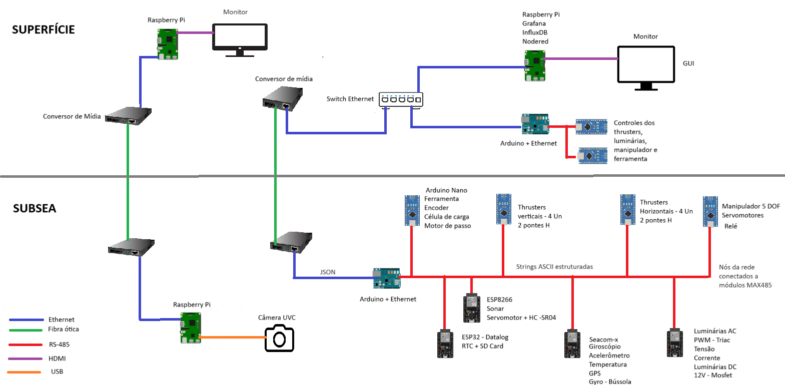

# ROV Lab Project

Este repositório contém o desenvolvimento de um sistema simulado de ROV (Remotely Operated Vehicle) com foco em aprendizado, telemetria distribuída e demonstração técnica de alto nível.

## 🔧 Tecnologias Utilizadas
- ESP32, Arduino Nano, STM32
- Rede RS-485
- Raspberry Pi 3B com Node-RED, InfluxDB e Grafana
- Comunicação via JSON, Ethernet e conversores de mídia (fibra óptica)
- Sensores: IMU, temperatura (NTC), tensão, corrente, RTC (DS3231)

## 🎯 Objetivo
Desenvolver um sistema de navegação e telemetria embarcada, simulando as funções de um ROV real, com interface gráfica em tempo real e arquitetura modular.

## 📁 Estrutura
- `codigo/`: firmwares e scripts
- `docs/`: documentação do projeto
- `arquitetura/`: diagramas e esquemas
- `CRONOGRAMA.md`: planejamento por sprints

## 📜 Licença
MIT License
