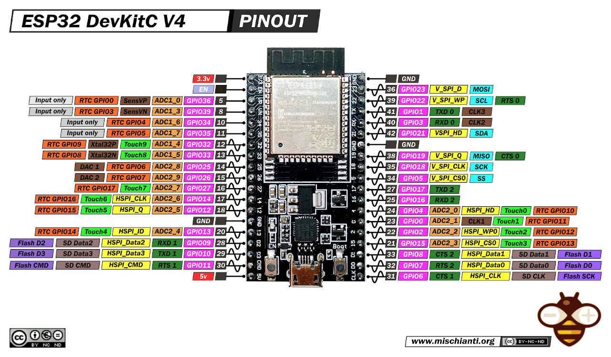
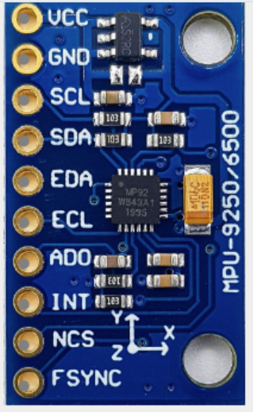
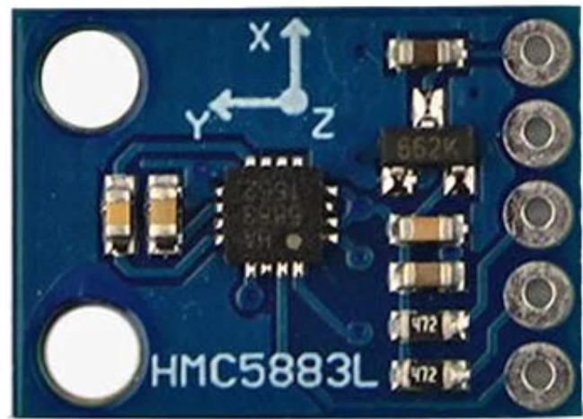
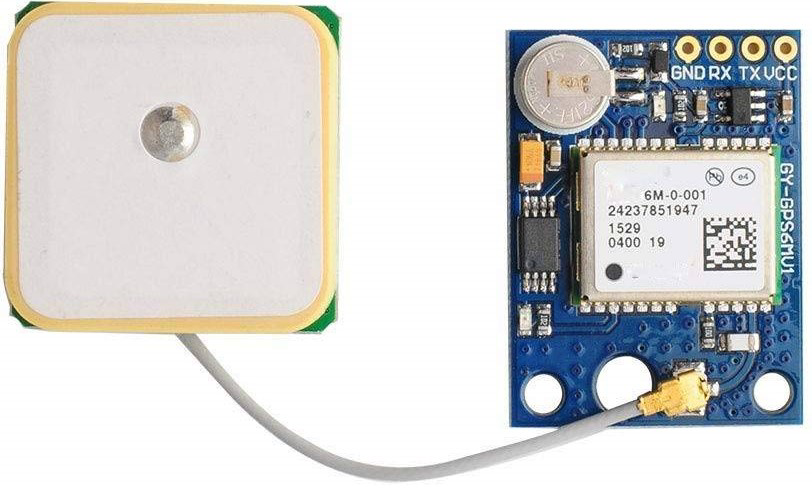
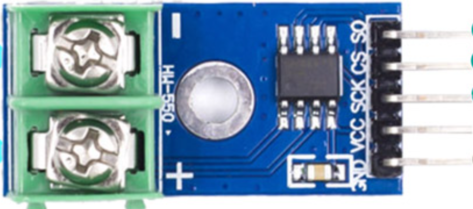
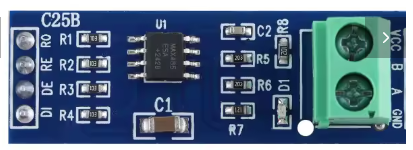

# SEACOM-X – Módulo de Navegação Embarcado

Este documento descreve a montagem física e a ligação dos sensores ao ESP32 para o módulo NAVCOM-X do projeto ROV simulado.

As conexões de cada sensor são listadas abaixo de suas respectivas imagens.

---

## 📦 ESP32 – Pinout

---

## 🔹 MPU-6050 (Acelerômetro + Giroscópio)

| Pino do Módulo | Vai no ESP32 |
|----------------|--------------|
| VCC            | 3.3V         |
| GND            | GND          |
| SDA            | GPIO 21      |
| SCL            | GPIO 22      |

---

## 🔹 HMC5883L (Bússola)

| Pino do Módulo | Vai no ESP32 |
|----------------|--------------|
| VCC            | 3.3V         |
| GND            | GND          |
| SDA            | GPIO 21 *(compartilhado)* |
| SCL            | GPIO 22 *(compartilhado)* |

---

## 🔹 GPS GY-NEO6MV2

| Pino do Módulo | Vai no ESP32 |
|----------------|--------------|
| VCC            | 3.3V         |
| GND            | GND          |
| TX             | GPIO 16 *(RX1)* |
| RX             | GPIO 17 *(TX1)* |

---

## 🔹 MAX6675 (Termopar tipo K)

| Pino do Módulo | Vai no ESP32 |
|----------------|--------------|
| VCC            | 3.3V         |
| GND            | GND          |
| SCK            | GPIO 18      |
| SO             | GPIO 19      |
| CS             | GPIO 5       |

---

---

## 🔸 Módulo MAX485 (RS-485)

| Pino do Módulo | Vai no ESP32 |
|----------------|--------------|
| RO (Receive Out) | GPIO 3 *(RX)*     |
| DI (Driver In)   | GPIO 1 *(TX)*     |
| DE (Enable)      | GND *(fixo ou GPIO controle)* |
| RE (Receive Enable) | GND *(fixo ou GPIO controle)* |
| VCC              | 3.3V ou 5V        |
| GND              | GND               |
| A/B              | Barramento RS-485 |
